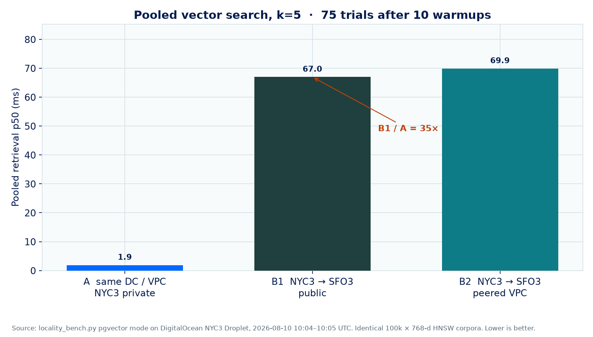
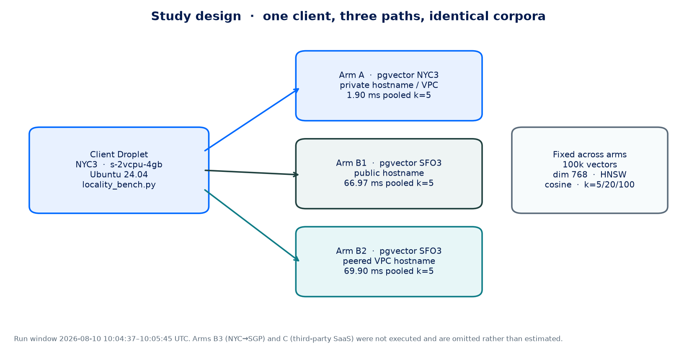
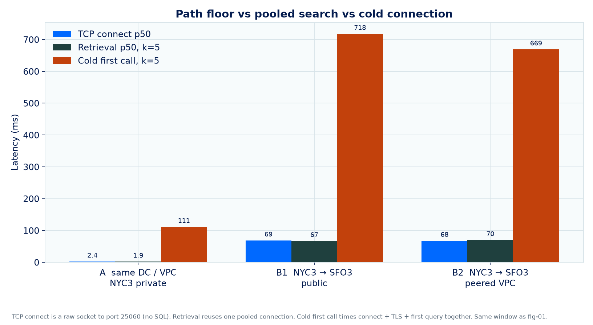
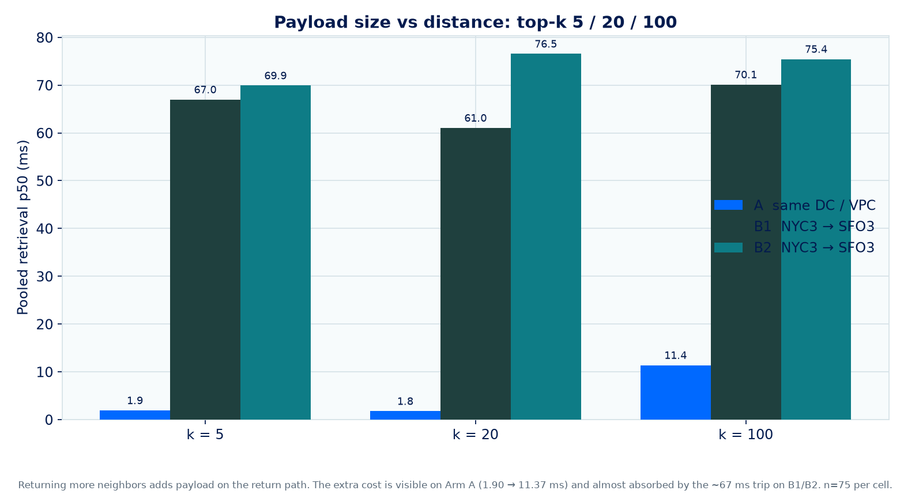
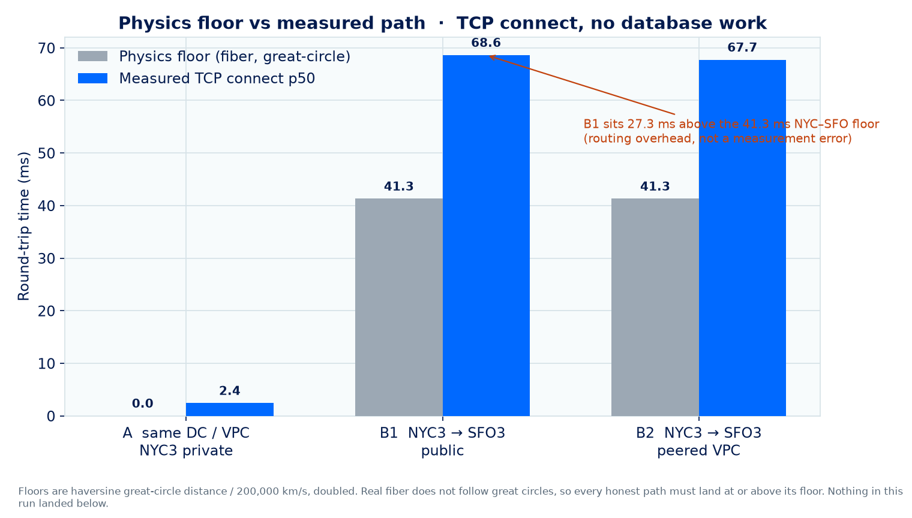
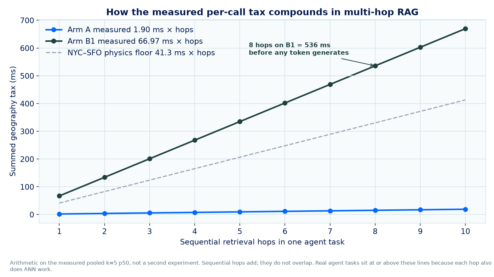
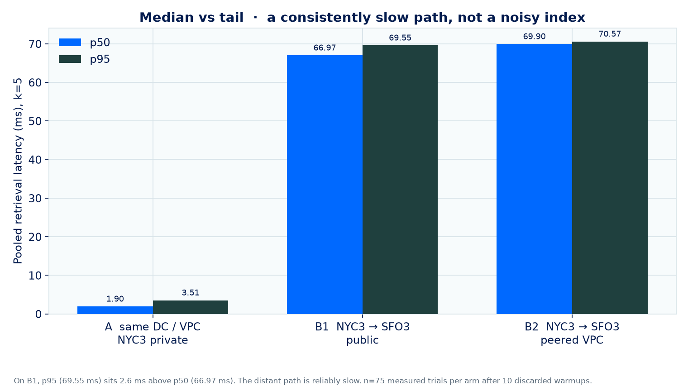

# The Data Locality Tax: measured retrieval latency across DigitalOcean regions

**A measurement study of how much RAG retrieval latency you pay when a DigitalOcean Managed PostgreSQL (pgvector) cluster sits in a different region from the Droplet issuing queries.**

This repository is the evidence base: harness, load SQL, raw per-cell JSON, and figures drawn from those files. Companion article: *"The Data Locality Tax: What a Wrong-Region Vector DB Costs Your RAG Pipeline"*.

| | |
| --- | --- |
| **Run** | 2026-08-10, 10:04:37–10:05:45 UTC |
| **Client** | Droplet `locality-tax-bench-nyc3` (`s-2vcpu-4gb`, Ubuntu 24.04), **NYC3** |
| **Arm A** | Managed PostgreSQL 16 + pgvector in **NYC3**, private hostname / same-DC VPC |
| **Arm B1** | Identical cluster in **SFO3**, public hostname |
| **Arm B2** | Same SFO3 cluster, private hostname over VPC peering |
| **Corpus** | 100,000 synthetic 768-d vectors, HNSW cosine, identical load script |
| **Trials** | 75 measured + 10 warmup per cell |

Full protocol: [METHODS.md](METHODS.md). Raw cells: [results/](results/). Plot code: [analysis/plot_results.py](analysis/plot_results.py).

---

## Headline

Same query, same index, same corpus. The only variable was the path.



*Figure 1. Median pooled search, k=5. Arm A 1.90 ms. Arm B1 66.97 ms (35×). Arm B2 69.90 ms. Lower is better.*

| Arm | Path | TCP RTT p50 | Retrieval p50 (k=5) | Retrieval p95 (k=5) | Retrieval p50 (k=100) | Cold first call (k=5) |
| --- | --- | ---: | ---: | ---: | ---: | ---: |
| A | Same DC, VPC (NYC3 private) | **2.43 ms** | **1.90 ms** | 3.51 ms | 11.37 ms | 111.34 ms |
| B1 | NYC3 → SFO3, public | **68.63 ms** | **66.97 ms** | 69.55 ms | 70.11 ms | 717.91 ms |
| B2 | NYC3 → SFO3, peered VPC | **67.73 ms** | **69.90 ms** | 70.57 ms | 75.44 ms | 668.87 ms |
| B3 | NYC → SGP, public | *not run* | | | | |
| C | Third-party SaaS | *not run* | | | | |

---

## What the run showed

1. **Same-DC VPC is the floor.** Arm A TCP p50 was 2.43 ms; pooled k=5 was 1.90 ms.
2. **A continent costs about 35× on pooled k=5.** B1 was 66.97 ms. The TCP probe alone (68.63 ms) already sat ~27 ms above the 41.3 ms NYC–SFO physics floor.
3. **Peering does not erase geography.** B2 matched B1 within a few milliseconds on every pooled column.
4. **On the long path, retrieval tracks TCP.** The index walk is not the bill you are paying.
5. **Cold connections multiply the tax.** B1 cold first call was 717.91 ms versus 66.97 ms pooled.
6. **Extra neighbors matter locally and almost vanish at distance.** k=100 vs k=5: 11.37 vs 1.90 ms on A; 70.11 vs 66.97 ms on B1.
7. **The distant path is consistently slow.** B1 p95 was 69.55 ms, 2.6 ms above p50.

---

## Figures from this run

Every PNG is generated from `results/*.json`. If a caption and a JSON file disagree, the JSON wins.



*Figure 0. One NYC3 client, three paths, identical corpora.*



*Figure 2. Path floor, pooled search, and cold first call.*



*Figure 3. k = 5, 20, 100. Payload shows up when the network is already fast.*



*Figure 4. Measured TCP sits above the fiber floor. Nothing landed below it.*



*Figure 5. Measured k=5 p50 × hop count. Eight hops on B1 = 536 ms before a token generates.*



*Figure 6. Median versus tail at k=5. Consistently slow, not noisy.*

---

## Reproduce

```bash
python3 -m venv .venv && source .venv/bin/activate
pip install -r requirements.txt
# on the Droplet: apt install postgresql-client

psql "$DSN_ARM_A" -f harness/load_corpus.sql
psql "$DSN_ARM_B" -f harness/load_corpus.sql

python3 harness/locality_bench.py --mode tcp --host <host> --port 25060 --out results/a_tcp.json
python3 harness/locality_bench.py --mode pgvector --dsn "$DSN_ARM_A" --k 5 --out results/a_k5.json

python3 analysis/plot_results.py
```

Trusted sources, VPC peering, and teardown are in the article runbook.

## Honest disclosures

- One time window. A second day is the right next measurement, not a different conclusion from this JSON.
- Synthetic random vectors measure the **path**, not recall.
- Smallest database plan (`db-s-1vcpu-1gb`). ANN time is not the comparison target; both arms shared index parameters.
- B3 and Arm C were not executed. Cells stay blank.

## Layout

```
harness/               locality_bench.py, load_corpus.sql
results/               raw per-cell JSON from the 2026-08-10 run
figures/               publication plots rendered from that JSON
analysis/plot_results.py
METHODS.md
```
